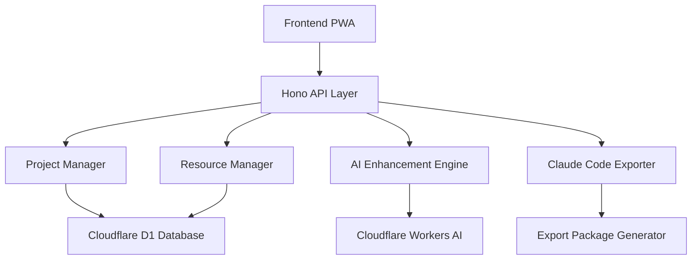

# Design Document

## Overview

The Claude Code Project Bootstrap System is a comprehensive web-based tool that enables developers to create, manage, and export complete Claude Code project structures. The system provides a visual interface for organizing AI agents, rules, and hooks into projects, with AI-enhanced creation capabilities and flexible export options that generate ready-to-use Claude Code development environments.

## Architecture

The system follows a three-tier architecture:

1. **Frontend Layer**: Progressive Web App (PWA) built with vanilla JavaScript providing responsive project management interfaces
2. **API Layer**: Cloudflare Workers with Hono framework handling HTTP requests and business logic
3. **Data Layer**: Cloudflare D1 (SQLite) database with AI enhancement via Cloudflare Workers AI

### Component Interaction Flow



## Components and Interfaces

### ProjectManager Class

**Purpose**: Core project lifecycle management and CRUD operations

**Key Methods**:
- `createProject(projectData)`: Creates new project with validation
- `updateProject(projectId, updates)`: Updates existing project
- `deleteProject(projectId)`: Handles project deletion with resource cleanup
- `getProject(projectId)`: Retrieves project with associated resources
- `listProjects(filters)`: Lists projects with filtering and pagination
- `importResources(projectId, resourceIds)`: Bulk resource import with dependency resolution

**Interface**:
```typescript
interface ProjectManager {
  createProject(data: ProjectData): Promise<Project>
  updateProject(id: string, updates: Partial<ProjectData>): Promise<Project>
  deleteProject(id: string): Promise<void>
  getProject(id: string): Promise<Project | null>
  listProjects(filters?: ProjectFilters): Promise<Project[]>
  importResources(projectId: string, resourceIds: string[]): Promise<ImportResult>
}
```

### ResourceManager Class

**Purpose**: Manages agents, rules, and hooks within project contexts

**Key Methods**:
- `assignResource(projectId, resourceId, resourceType)`: Creates project-resource relationships
- `unassignResource(projectId, resourceId)`: Removes resource assignments
- `getAvailableResources(projectId)`: Lists importable resources with compatibility
- `getResourceDependencies(resourceId)`: Identifies related resources for import

**Interface**:
```typescript
interface ResourceManager {
  assignResource(projectId: string, resourceId: string, type: ResourceType): Promise<void>
  unassignResource(projectId: string, resourceId: string): Promise<void>
  getAvailableResources(projectId: string): Promise<AvailableResource[]>
  getResourceDependencies(resourceId: string): Promise<ResourceDependency[]>
}
```

### AIEnhancementEngine Class

**Purpose**: Provides contextual AI suggestions using Cloudflare Workers AI

**Key Methods**:
- `enhanceResourceCreation(projectContext, resourceType)`: Generates AI suggestions
- `buildContextPrompt(projectData, existingResources)`: Creates context for AI
- `validateResourceCompatibility(resource, projectContext)`: AI-powered compatibility checking

**Interface**:
```typescript
interface AIEnhancementEngine {
  enhanceResourceCreation(context: ProjectContext, type: ResourceType): Promise<AISuggestion[]>
  buildContextPrompt(project: Project, resources: Resource[]): string
  validateResourceCompatibility(resource: Resource, context: ProjectContext): Promise<CompatibilityResult>
}
```

### ClaudeCodeExporter Class

**Purpose**: Generates complete Claude Code project structures with flexible export options

**Key Methods**:
- `exportProject(projectId, exportOptions)`: Main export orchestration
- `promptExportDestination()`: Handles user export destination selection
- `generateClaudeMD(projectData)`: Creates CLAUDE.md documentation
- `generateProjectSettings(projectData)`: Creates .claude/project_settings.json
- `generateAgentFiles(agents)`: Creates individual agent files
- `generateRulesFile(rules)`: Creates consolidated rules file
- `packageForDownload(files)`: Creates ZIP package for download
- `exportToDirectory(files, destinationPath)`: Exports directly to local directory

**Interface**:
```typescript
interface ClaudeCodeExporter {
  exportProject(projectId: string, options: ExportOptions): Promise<ExportResult>
  promptExportDestination(): Promise<ExportDestination>
  generateClaudeMD(project: Project): string
  generateProjectSettings(project: Project): ProjectSettings
  generateAgentFiles(agents: Agent[]): FileMap
  generateRulesFile(rules: Rule[]): string
  packageForDownload(files: FileMap): Promise<Blob>
  exportToDirectory(files: FileMap, path: string): Promise<void>
}
```

## Data Models

### Project Model
```typescript
interface Project {
  id: string
  name: string
  description: string
  slug: string
  createdAt: Date
  updatedAt: Date
  settings: ProjectSettings
  resources: ProjectResource[]
}

interface ProjectSettings {
  defaultAgent?: string
  exportFormat: 'zip' | 'directory'
  includeDocumentation: boolean
  customRules: string[]
}
```

### Resource Models
```typescript
interface ProjectResource {
  projectId: string
  resourceId: string
  resourceType: 'agent' | 'rule' | 'hook'
  assignedAt: Date
}

interface Agent {
  id: string
  name: string
  role: string
  capabilities: string[]
  outputFormat: OutputFormat
  guidelines: string[]
}

interface Rule {
  id: string
  name: string
  description: string
  content: string
  category: string
  applicableContexts: string[]
}

interface Hook {
  id: string
  name: string
  trigger: HookTrigger
  actions: HookAction[]
  conditions: HookCondition[]
}
```

### Export Models
```typescript
interface ExportOptions {
  destination: ExportDestination
  format: 'zip' | 'directory'
  includeDocumentation: boolean
  customizations: ExportCustomization[]
}

interface ExportDestination {
  type: 'download' | 'directory'
  path?: string // For directory exports
}

interface ExportResult {
  success: boolean
  files: FileMap
  downloadUrl?: string // For ZIP downloads
  exportPath?: string // For directory exports
  errors: string[]
}
```

## Correctness Properties

*A property is a characteristic or behavior that should hold true across all valid executions of a system-essentially, a formal statement about what the system should do. Properties serve as the bridge between human-readable specifications and machine-verifiable correctness guarantees.*

### Property 1: Project data persistence and integrity
*For any* valid project data and resource assignments, creating a project with resources and then retrieving it should return equivalent project information with all assigned resources preserved and no data duplication across projects
**Validates: Requirements 1.5, 2.4, 7.1**

### Property 2: AI-enhanced contextual suggestions
*For any* project context and resource type, AI enhancement should return suggestions that are relevant to the project's domain, incorporate existing project resources, and provide appropriate contextual recommendations
**Validates: Requirements 2.1, 2.2, 4.1, 4.2, 4.4**

### Property 3: Import functionality preservation
*For any* set of resources imported into a project, the imported resources should maintain their original definitions while being properly associated with the target project and identifying any dependencies
**Validates: Requirements 3.3, 3.4**

### Property 4: Export destination selection and generation
*For any* export operation, the system should prompt for the user's export destination preference and generate complete Claude Code project structures with all required files (CLAUDE.md, project settings, agent files, rules) in the chosen format
**Validates: Requirements 5.1, 5.2, 5.3, 5.4, 5.5, 5.6, 5.7**

### Property 5: Project-aware prompt generation
*For any* project context and selected agent, generated prompts should incorporate the project's rules, agent capabilities, formatting preferences, and maintain proper XML structure for Claude Code integration
**Validates: Requirements 6.2, 6.3, 6.4**

### Property 6: Data consistency during operations
*For any* multi-step operation (like project deletion or resource updates), either all changes should be applied successfully or the system should remain in its original state with proper transaction rollback
**Validates: Requirements 7.2, 7.3, 7.5**

### Property 7: Comprehensive validation and error handling
*For any* resource or project configuration, validation should identify all Claude Code compatibility issues, missing dependencies, and provide clear error messages with specific guidance for resolution
**Validates: Requirements 8.1, 8.2, 8.3, 8.4, 8.5**

## Error Handling

### Validation Errors
- **Resource Validation**: Check agent definitions, rule syntax, and hook configurations against Claude Code standards
- **Project Validation**: Ensure required fields, valid relationships, and export readiness
- **Export Validation**: Verify all dependencies are present and properly configured

### System Errors
- **Database Errors**: Transaction rollback with user-friendly error messages
- **AI Service Errors**: Graceful fallback when Cloudflare Workers AI is unavailable
- **Export Errors**: Clear guidance when export operations fail due to missing components or permissions

### User Experience
- **Progressive Error Disclosure**: Show validation errors as users interact with forms
- **Recovery Guidance**: Provide specific steps to resolve validation and system errors
- **Graceful Degradation**: Core functionality remains available when AI enhancement fails

## Testing Strategy

### Unit Testing
The system will use standard JavaScript testing frameworks (Jest or Vitest) for unit tests covering:
- Individual component methods and validation logic
- Error handling and edge cases
- API endpoint functionality
- Database operations and transaction handling

### Property-Based Testing
The system will use **fast-check** as the property-based testing library to verify universal properties across all inputs. Each property-based test will run a minimum of 100 iterations to ensure comprehensive coverage of the input space.

**Property-based testing requirements**:
- Each correctness property will be implemented by a single property-based test
- Tests will be tagged with comments referencing the design document property: `**Feature: claude-code-bootstrap, Property {number}: {property_text}**`
- Smart generators will be created to constrain inputs to valid system states
- Tests will focus on core logic without mocking to maintain simplicity

**Dual testing approach**:
- Unit tests verify specific examples, integration points, and error conditions
- Property tests verify universal properties that should hold across all inputs
- Together they provide comprehensive coverage: unit tests catch concrete bugs, property tests verify general correctness

### Integration Testing
- End-to-end workflows from project creation through export
- API endpoint integration with database operations
- AI enhancement integration with fallback scenarios
- Export generation with various project configurations

The testing strategy ensures both specific functionality works correctly (unit tests) and that universal system properties hold across all possible inputs (property-based tests).