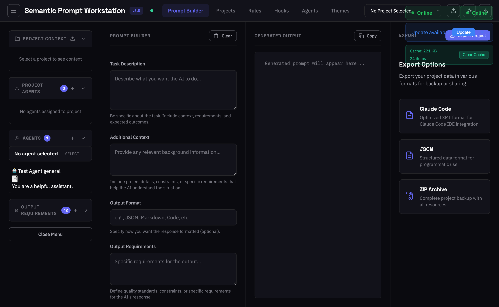
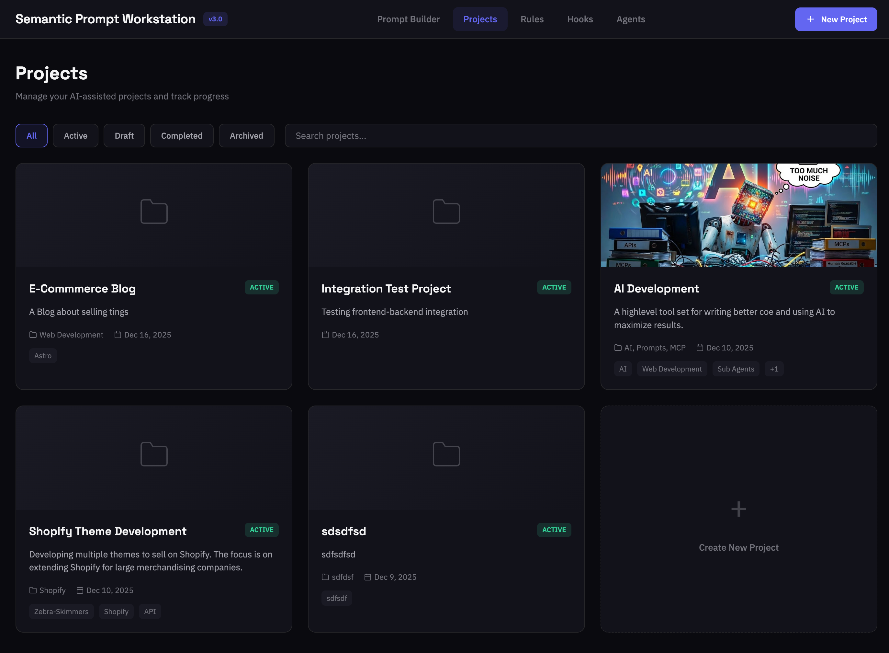
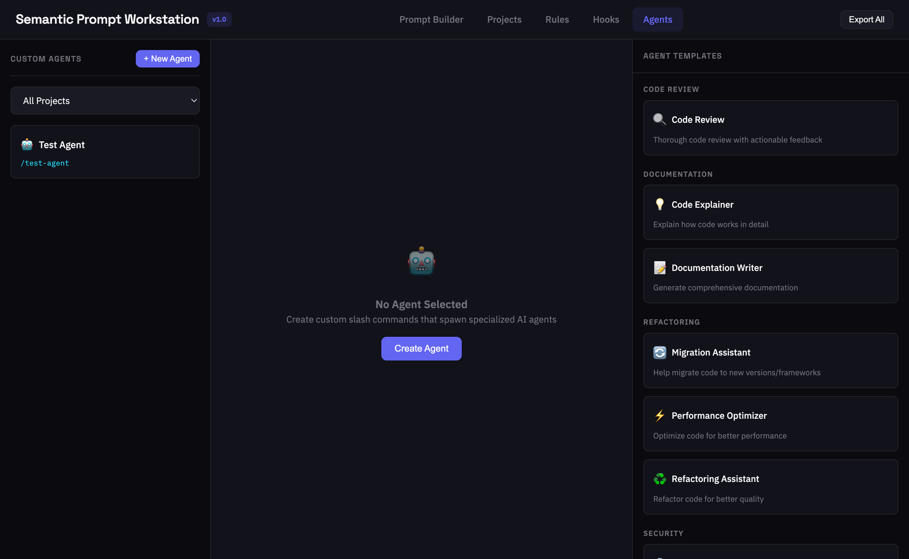
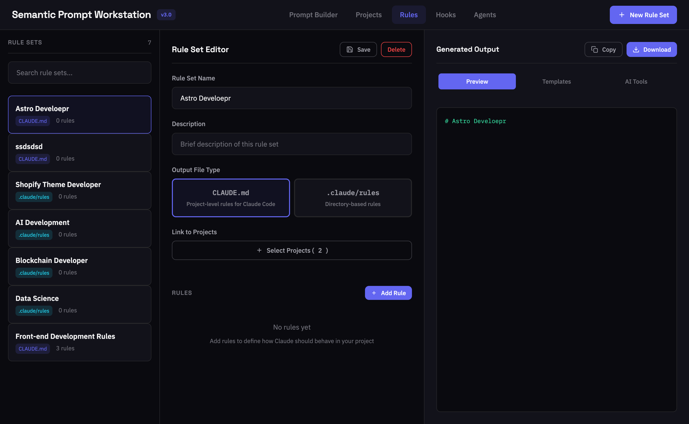
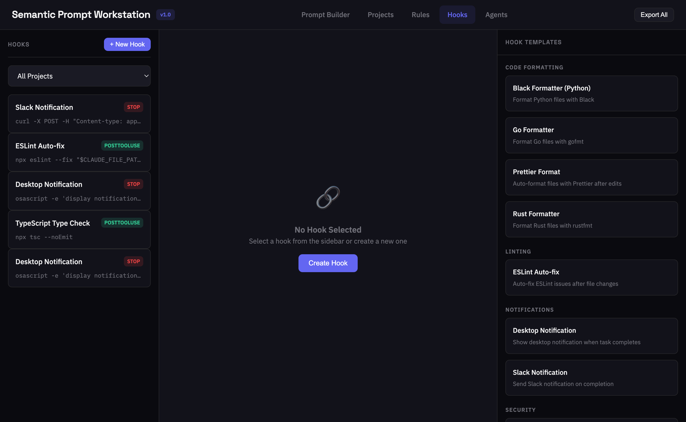

# Semantic Prompt Workstation

**Semantic Prompt Workstation** is a Progressive Web App (PWA) for generating semantic, well-structured prompts for AI models. It combines agent personas with tasks, context, and formatting requirements to produce contextually-rich prompts.

## Interface Overview

### Prompt Builder (Home)



The **Prompt Builder** is the main interface for creating AI prompts. It provides an interactive form where you can:
- Select an agent persona to define the AI's role and expertise
- Specify the task you want the AI to accomplish
- Add context and constraints to guide the response
- Define output format requirements
- Generate semantic, well-structured prompts ready for use with Claude or other AI models

### Projects



The **Projects** page allows you to organize your work into logical groupings. Each project can contain:
- Multiple prompts tailored to specific use cases
- Assigned agents with their personas and expertise
- Custom rules for IDE configuration
- Hooks for automation workflows
- Export functionality to generate complete Claude Code project structures

Projects help teams standardize AI workflows and maintain consistent configurations across development environments.

### Agents



The **Agents** page is where you create and manage AI personas. Each agent defines:
- **Name**: A descriptive identifier (e.g., "Senior Python Developer")
- **Role**: The persona description defining expertise, behavior, and domain knowledge
- **Output Style**: Preferences for how responses should be formatted

Agents can be assigned to projects and used across multiple prompts to maintain consistent AI behavior.

### Rules



The **Rules** page enables you to create IDE-specific configuration files. Supported formats include:
- **Claude Code** (`.claude/rules.md`) - Rules for Claude Code CLI
- **Cursor** (`.cursorrules`) - Configuration for Cursor IDE
- **Windsurf** (`.windsurfrules`) - Rules for Windsurf editor
- **VS Code** (`.vscode/settings.json`) - VS Code workspace settings
- **Zed** (`.zed/settings.json`) - Zed editor configuration

Rules help enforce coding standards, define project conventions, and guide AI behavior within your development environment.

### Hooks



The **Hooks** page lets you define automation triggers for Claude Code workflows. Hooks execute shell commands in response to lifecycle events:
- **PreToolUse**: Run before a tool executes
- **PostToolUse**: Run after a tool completes
- **Notification**: Triggered on specific events
- **Stop**: Control when Claude should pause

Each hook can be configured with:
- Event type and timing
- Shell commands to execute
- Matchers for filtering (tool names, file patterns)
- Timeout settings

Hooks enable automated testing, linting, formatting, and custom validation workflows.

---

## Core Features

- **Agent Management**: Create and manage AI agent personas with custom roles and output styles
- **Prompt Builder**: Interactive form for specifying tasks, context, constraints, and output formats  
- **Semantic Generation**: Combines agent persona + task + context + format into structured prompts
- **Claude Code Project Bootstrap**: Complete project management system for creating, organizing, and exporting ready-to-use Claude Code project structures *(Phase 2: 23% Complete - Database, CRUD & Resource Management implemented)*
- **AI-Enhanced Resource Creation**: Contextual suggestions for agents, rules, and hooks using Cloudflare Workers AI *(Planned)*
- **Project-Based Organization**: Visual project management with resource assignment and dependency tracking *(Planned)*
- **Complete Export System**: Generate full Claude Code project structures with CLAUDE.md, agent files, and configuration *(Planned)*
- **Theme Management**: Customizable color palettes and font combinations with live preview *(Planned)*
- **PWA Support**: Full offline functionality with service worker caching
- **Cloud Backend**: Cloudflare Workers with D1 database for data persistence and AI enhancement
- **Rule Sets**: Generate IDE-specific configuration files (Claude Code, Cursor, etc.) *(Planned)*
- **AI Enhancement**: Cloudflare Workers AI integration for prompt optimization

## Target Use Cases

- **Claude Code Users**: Bootstrap complete development environments with organized agents, rules, and configurations
- **Development Teams**: Standardize AI workflows across projects with reusable resource libraries
- **Project Managers**: Structure complex AI-assisted workflows with visual project organization
- **Individual Developers**: Create consistent prompts and maintain organized agent personas
- **Content Creators**: Build and export reusable prompt templates and agent configurations

## Architecture

- **Frontend**: Vanilla JavaScript PWA with responsive design
- **Backend**: Cloudflare Workers with Hono framework
- **Database**: Cloudflare D1 (SQLite) for structured data storage
- **AI Integration**: Cloudflare Workers AI for prompt enhancement and analysis

## Tech Stack

### Frontend
- **Framework**: Vanilla JavaScript (no framework dependencies)
- **Styling**: CSS3 with custom properties and CSS Grid/Flexbox
- **PWA**: Service Worker for offline support, Web App Manifest
- **Storage**: Browser localStorage for client-side persistence
- **Fonts**: IBM Plex Sans, IBM Plex Mono, Space Grotesk

### Backend
- **Runtime**: Cloudflare Workers
- **Framework**: Hono.js for HTTP routing and middleware
- **Database**: Cloudflare D1 (SQLite-based)
- **AI**: Cloudflare Workers AI (Llama 3.1 8B Instruct model)
- **Assets**: Cloudflare Workers Assets for static file serving

## Getting Started

### Frontend Only (Local Development)

1. Clone the repository:
   ```bash
   git clone https://github.com/dylanburkey/claude-code-ai-promt-assist.git
   cd claude-code-ai-promt-assist
   ```

2. Serve the files locally:
   ```bash
   # Using Python
   python -m http.server 8000
   
   # Using Node.js
   npx serve
   
   # Using PHP
   php -S localhost:8000
   ```

3. Open `http://localhost:8000` in your browser

### Full Stack Development

1. Set up the backend:
   ```bash
   cd worker
   npm install
   npm run dev
   ```

2. In another terminal, serve the frontend or access via the worker's asset serving

### Production Deployment

Deploy to Cloudflare Workers:
```bash
cd worker
npm run deploy
```

### Install as PWA

Click the install button in your browser's address bar to add the app to your home screen for offline access.

## Usage

### Creating an Agent

1. Click the **+** button in the Agent Library sidebar
2. Fill in the agent details:
   - **Name**: Display name (e.g., "Senior Python Dev")
   - **Role**: Persona description defining expertise and behavior
   - **Style**: Output style preferences
3. Click **Save**

### Building a Prompt

1. Select an agent from the library
2. Fill in the Prompt Builder fields:
   - **Task**: What you want the AI to accomplish
   - **Context & Constraints**: Background information and limitations
   - **Output Format**: How you want the response structured
3. Click **Generate Prompt**
4. Copy the generated prompt from the output panel

### Importing/Exporting Agents

- **Export**: Click the export button to download your agents as a JSON file
- **Import**: Click the import button to load agents from a JSON file

## Project Structure

```
├── index.html          # Main PWA application (single-page app)
├── manifest.json       # PWA manifest configuration
├── sw.js              # Service Worker for offline support
├── icon.svg           # Application icon
├── README.md          # Project documentation
├── docs/              # Comprehensive documentation
└── worker/            # Cloudflare Workers backend
    ├── src/
    │   └── index.js           # Main Hono application with all API routes
    ├── public/                # Static assets served by Workers
    ├── migrations/           # D1 database schema migrations
    ├── package.json         # Node.js dependencies and scripts
    └── wrangler.toml       # Cloudflare Workers configuration
```

## Documentation

Comprehensive documentation is available in the `/docs` directory:

- **[Setup Guide](docs/setup/)** - Installation and configuration
- **[API Documentation](docs/api/)** - Complete API reference
- **[Development Guide](docs/development/)** - Development workflows and guidelines
- **[Database Schema](docs/database/)** - Database structure and migrations
- **[Deployment Guide](docs/deployment/)** - Production deployment instructions

## Browser Support

Works in all modern browsers that support:
- ES6+ JavaScript
- CSS Custom Properties
- Service Workers
- localStorage

## Common Commands

### Development
```bash
# Start local development server (worker)
cd worker && npm run dev

# Deploy to production
cd worker && npm run deploy

# View live logs
cd worker && npm run tail
```

### Frontend Development
```bash
# Serve frontend locally (any static server)
python -m http.server 8000
# or
npx serve
# or  
php -S localhost:8000
```

### Database Management
```bash
# Run migrations (via Wrangler)
wrangler d1 migrations apply prompt-workstation-db

# Query database locally
wrangler d1 execute prompt-workstation-db --local --command "SELECT * FROM agents"
```

## Browser Support

Works in all modern browsers that support:
- ES6+ JavaScript
- CSS Custom Properties
- Service Workers
- localStorage

| Browser | Minimum Version |
|---------|----------------|
| Chrome | 80+ |
| Firefox | 75+ |
| Safari | 13+ |
| Edge | 80+ |

## License

MIT License - feel free to use and modify as needed.

## Contributing

Contributions are welcome! Please see the [Development Guide](docs/development/) for coding standards and workflow guidelines.
